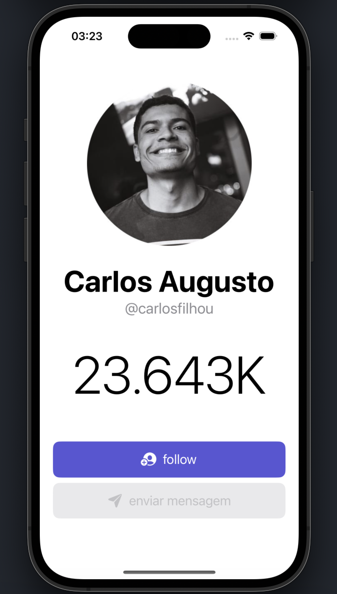
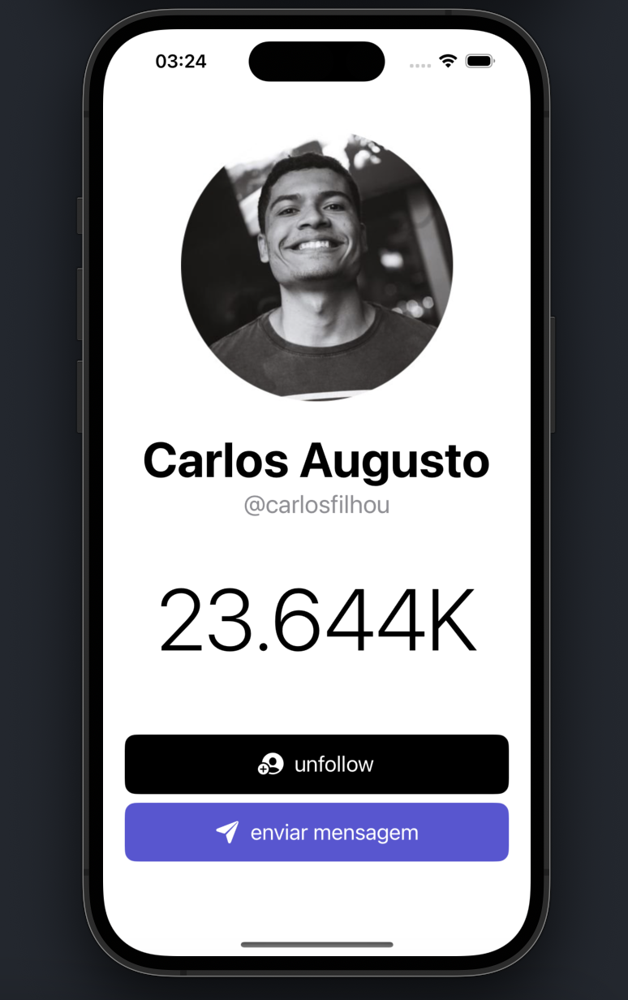

## Movie Gallery

Follower gain and loss project to put into practice and make all the necessary notes on the MVVM architectural pattern / Projeto de ganho e perdas de seguidores para colocar em prática e fazer todas as anotações necessárias do padrão arquitetural MVVM

## Screenshots

  
  

## Requisitos

1. Xcode 14.0

## Como rodar o projeto
1. Clone este repositório
2. Instale as ferramentas de desenvolvimento: `brew bundle && bundle install`
3. Selecione o target `MediaFollower` e execute o aplicativo no simulator

## Tecnologias Utilizadas

Swift & SwiftUI

## Autores

